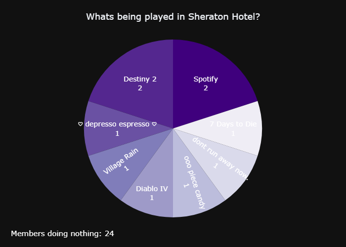

# visuals_bot.py README

## Overview

`visuals_bot.py` is a Python program that creates visual representations of Discord server member activity using pie charts. It is designed to be used as a Discord bot, and it generates and sends these visual representations in response to user commands. This README provides information on how to use the bot, its structure, and how to customize it for your needs.



## Features

- Creates pie charts that visualize Discord server member activity.
- Shows what members are playing in a server.
- Identifies members who are not currently engaged in any activity.
- The program can be easily extended to create other types of charts as needed.

## Prerequisites

Before using `visuals_bot.py`, make sure you have the following dependencies installed:

- [Python](https://www.python.org/downloads/)
- [discord.py](https://discordpy.readthedocs.io/en/stable/)
- [Plotly](https://plotly.com/python/getting-started/)

## Getting Started

1. Clone or download the repository containing `visuals_bot.py` and `piechart.py`.

2. Create a Discord bot and obtain its token. You can follow the official guide on [Creating a Bot Account](https://discordpy.readthedocs.io/en/stable/discord.html) to create a bot and retrieve its token.

3. Replace `"YOUR_BOT_TOKEN_HERE"` in `visuals_bot.py` with your bot's token:

   ```python
   token = "YOUR_BOT_TOKEN_HERE"
   ```

4. Customize the chart types and visuals as needed by modifying the `PieChart` or `BarChart` classes in `piechart.py`, or extending `ActivityChart` yourself with a different chart type. The `ActivityChart` class serves as the base for creating different types of charts, just create a child class and define the method `_create_visual(self)` that defines `self.fig` as a plotly figure, then use it the same was as shown here with PieChart.

## Usage

To use the `visuals_bot.py` program, follow these steps:

1. Invite your bot to a Discord server.

2. Start the bot by running the `visuals_bot.py` script.

3. In your Discord server, use the `/Activity` command to trigger the bot to create and send a pie chart visual representation of the member activity in the current channel.

4. The bot will respond with the visual representation, showing what members are playing and how many are not engaged in any activity.

To add the PieChart feature to your own bot:

1. Copy `piechart.py` to your project folder.

2. `from piechart import PieChart`

3. To send a piechart from your bot simply create a Piechart object by passing in a TextChannel (e.g. the channel the command was used in), then you can use the .image attribute as simply as:
   ```python
   @client.event
   async def on_message(message):
   if message.content.startswith('/Activity'):
     visual = PieChart(message.channel).image
     await message.channel.send(file=discord.File(fp=visual, filename=f'{message.guild.name}.png'))
   ```

## Extending Functionality

The `ActivityChart` class in `piechart.py` can be extended to create other types of charts or visual representations. You can build upon the existing code to add new chart types and customize the visuals to suit your needs.
